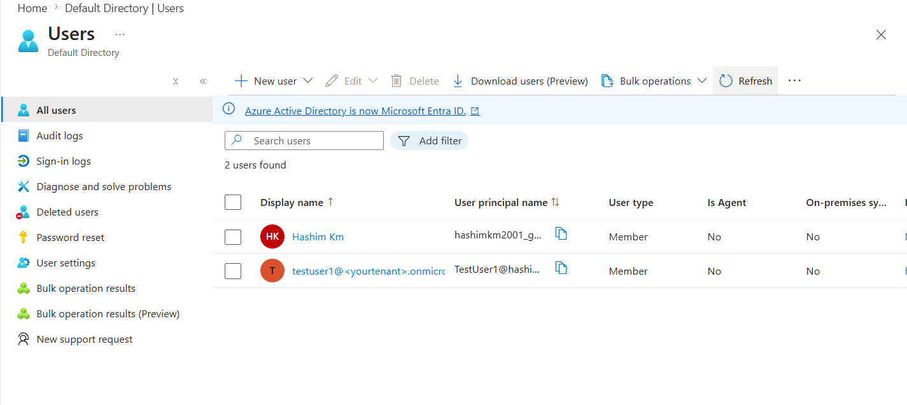
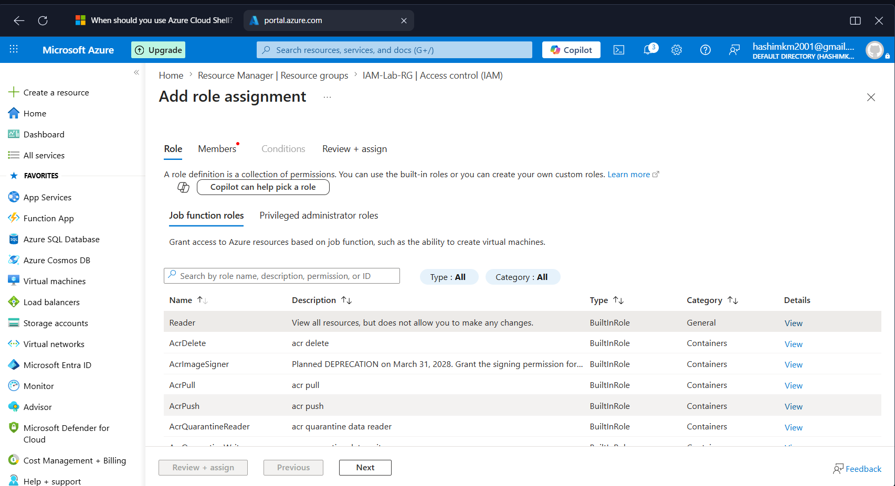
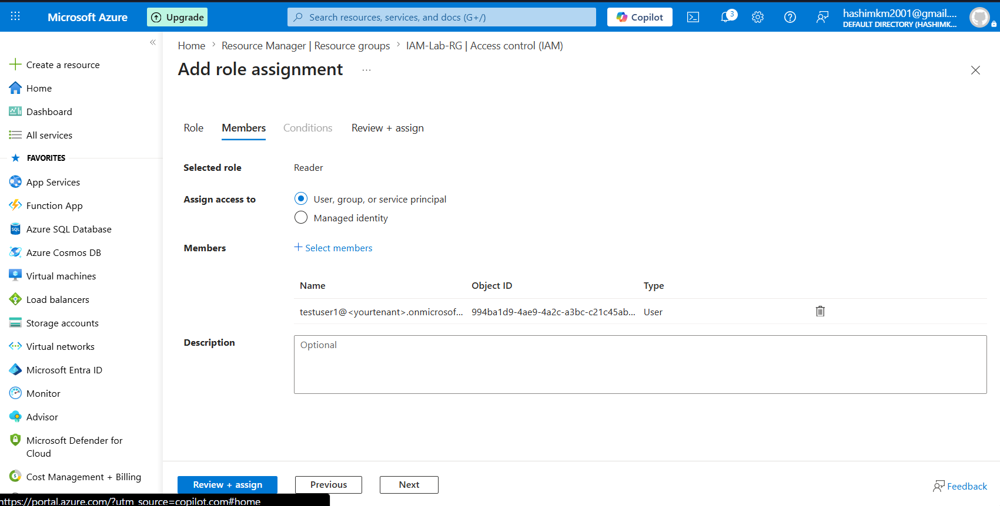
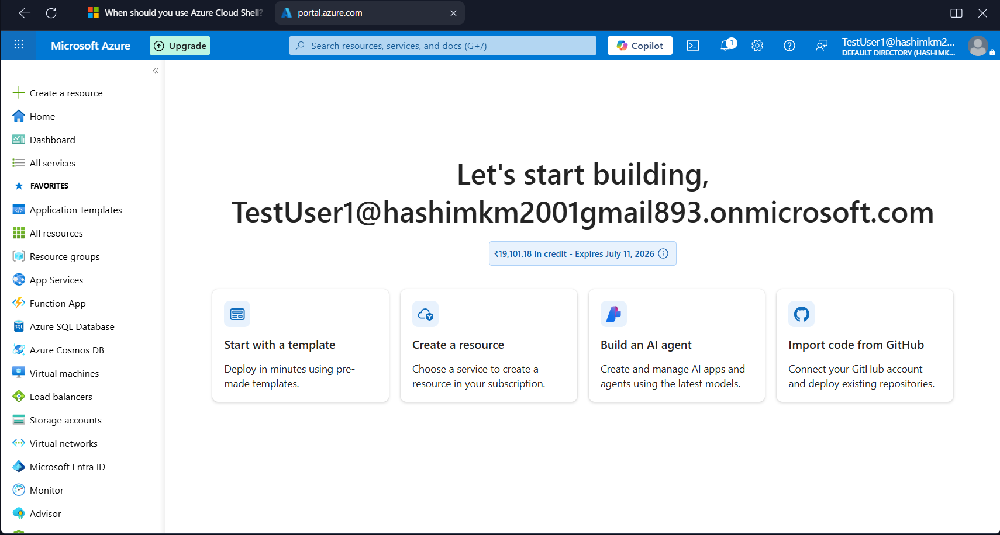

# Identity & RBAC Lab (Azure)

## 🎯 Objective
Demonstrate role-based access control (RBAC) in Azure by creating a test user, assigning roles, and testing permissions.

## 🛠 Steps
1. Created a new user **TestUser1** in Microsoft Entra ID.
2. Created a resource group **IAM-Lab-RG**.
3. Assigned **Reader role** to TestUser1.
4. Logged in as TestUser1 → attempted VM creation → received authorization error.
5. Changed role to **Contributor** → logged in again → successfully created VM.

## 📸 Screenshots
- New user creation form
  
- Role assignment blade
  
  
  
- Portal home logged in as TestUser1
  
- Error message for Reader role
  [Reader Error](Assets/readererror.png)
- Successful VM creation for Contributor role
  

## 📚 Lessons Learned
- Always use **UPN (username@tenant.onmicrosoft.com)** for login, not display name.
- **Reader vs Contributor roles** demonstrate clear differences in permissions.
- RBAC is essential for secure resource management in Azure.

## ✅ Outcome
This lab proves practical understanding of Azure identity management and RBAC, aligning with **AZ-104 exam objectives**.

